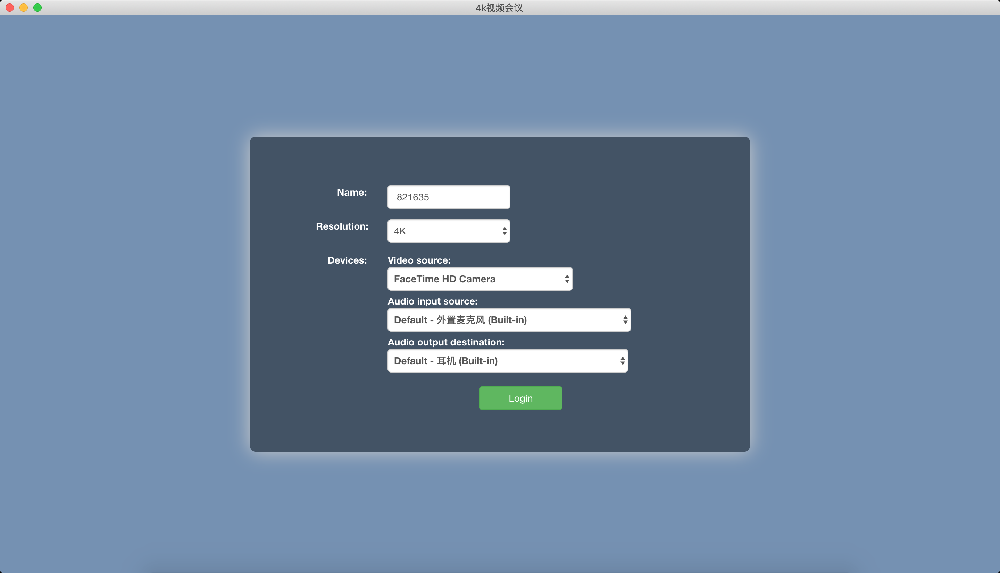
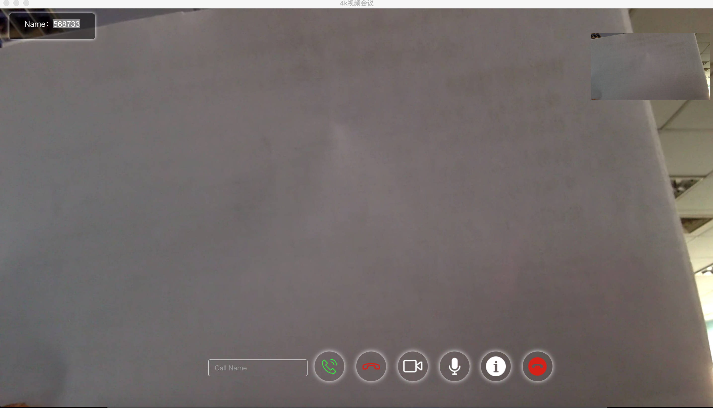
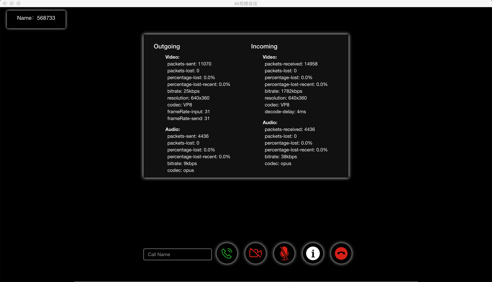

## webrtc点对点呼叫视频会议

### 简介
  结合Electron构建桌面应用
  信令：websocket;
  可构建mac端/win端；
  
  #### 功能：
    呼叫远端用户；
    选择本地媒体设备；
    选择不同分辨率；
    摄像头/麦克风开关切换；
    流媒体信息获取；
    
### 预览
1.登录（选择分辨率/摄像头/音频）


2. 调用本地摄像头获取画面


3.呼叫远端用户，建立点对点连接视频通话（可开关本地摄像头和麦克风）


4.建立点对点连接后，获取当前流媒体相关信息（如分辨率，丢包率等实时数据）


## 如何使用
```bash
# Clone this repository
git clone https://github.com/silenceLXD/webrtc-p2p.git
# Go into the repository
cd webrtc-p2p
# Install dependencies
npm install
# Run the app
electron .
# build app
npm run package:mac  // mac 桌面程序
# or
npm run package:win // win 桌面程序
```
